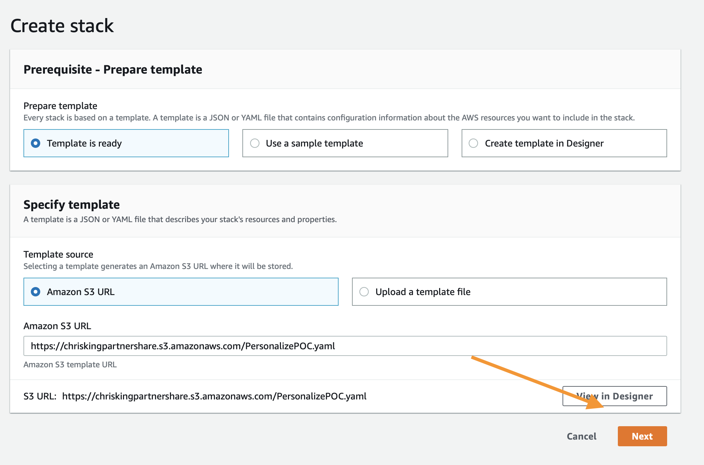

# Personalize POC 指南

Amazon Personalize是一种能让你快速有效地构建和扩展推荐或者个性化模型的机器学习服务。以下的内容是为了帮你构建出本POC所述用例上的你的第一个模型，并且假定你的数据还不是Amazon Personalize使用的理想格式。

本指南假定你基本熟悉了Amazon Personalize服务。如果你对该服务还不熟悉，建议学习下面的入门资料。

## Amazon Personalize介绍

如果你对Amazon Personalize服务还不熟悉，你可以访问下面这几个页面来了解关于这个工具的更多信息：

* [Product Page](https://aws.amazon.com/personalize/)
* [GitHub Sample Notebooks](https://github.com/aws-samples/amazon-personalize-samples)
* [Product Docs](https://docs.aws.amazon.com/personalize/latest/dg/what-is-personalize.html)

## 目标 

到本POC结束时，应该掌握了以下技能：

1. 如何将数据集映射到 Amazon Personalize.
1. 模型或配方与用例的适用关系.
1. 如何以 API 调用的方式构建模型.
1. 对模型指标的解释.
1. 以 API 调用的方式部署模型.
1. 从 Amazon Personalize 获得结果.

## 过程:

1. 部署你的工作环境[见下方]
1. 验证和导入user-item-interaction 数据 - 
`01_Validating_and_Importing_User_Item_Interaction_Data.ipynb`
1. 验证和导入item-metadata数据 - 
`02_Validating_and_Importing_Item_Metadata.ipynb`
1. 创建和评估你的第一个方案 - 
`03_Creating_and_Evaluating_Solutions.ipynb`
1. 部署活动（campaign）和筛选器 -
`04_Deploying_Campaigns_and_Filters.ipynb`
1. 与活动（campaigns）和筛选器交互 -
`05_Interacting_with_Campaigns_and_Filters.ipynb`
1. 清空你的AWS账号中用到的资源 - `06_Clean_Up_Resources.ipynb`

以上为本POC过程的一般顺序。但是，如果你是参加一个两天的现场POC，建议你在到达实验现场之前事先导入user-item-interaction 和item-metadata数据。

## 部署你的工作环境

如上所述，第一步要做的是部署一个CloudFormation模板，通过它执行大部分初始化设置的工作。打开另一个浏览器窗口或选项卡，在上面登录到你的亚马逊云科技帐户。完成后，在新选项卡中打开下面的链接，开始通过CloudFormation部署所需项目的过程。

如果对部署CloudFormation stack有任何疑问，请按照下面的屏幕截图进行操作。

### Cloud Formation 向导

从点击页面底部的`Next`按钮开始，如下：

在这一页需要完成如下任务:

1. 将Stack名称改成如`PersonalizePOC`这样的
1. 更改Notebook 的名称 (可选)
1. 更改SageMaker EBS 卷的VolumeSize, 默认是10GB。如果你的数据集更大，请相应地增大这个数值。

当你完成后点击底部的`Next`按钮.

这一页有点长，所以请滚动页面到底部，然后单击`Next`按钮。执行本POC时所有的输入项都使用默认值就行了，如果你有定制需求，请根据需要进行更改。

同样在这一页滚动到底部，在“I acknowledge that AWS CloudFormation might create IAM resources”左边的复选框打勾，然后点击`Create Stack`按钮。

CloudFormation会在几分钟内创建好前面描述的资源。部署时的页面如下所示：

在部署完成后，你可以看到如下所示的绿色的文字，表示工作已经完成：

现在你的环境已经创建好了，请转到SageMaker的服务页面，方法是单击控制台顶部的`Services`，然后搜索`SageMaker`并单击服务名.

在SageMaker控制台中，滚动页面直到看到下图所示的绿色框，表示你现在有许多Notebook正在使用，然后单击它.

在这个页面上，你会看到你运行的任何SageMaker notebook的列表，只需点击你创建的PersonalizePOC Notebook这一条的`Open JupyterLab`链接

这样就可以打开运行本POC的Jupyter环境；如果你不熟悉它，就把它看成是一个基于web的进行数据科学开发的IDE。页面打开后应该会自动打开`PersonalizePOC`文件夹，如果没有，只需单击屏幕左侧浏览器中的文件夹图标，然后按照下面的文档步骤开始这个POC!

## 验证和导入User-Item-Interaction 数据

用于Amazon Personalize中每个算法的核心数据都是用户项交互数据user-item-interaction；本notebook将指导你识别这些数据，然后格式化这些数据使之可以用在Personalize服务中，并且定义你的数据模式（schema），最后导入这些数据. 

打开 `01_Validating_and_Importing_User_Item_Interaction_Data.ipynb` 并执行其中的步骤.

在你完成以后，继续执行下一步，导入元数据.

## 验证和导入 Item Metadata

Amazon Personalize有几种算法可以给你一个没有元数据的结果。但是，User Personalization和HRNN-Metadata算法可能是有趣的资源可用于部署，视你的数据集而定. 

打开 `02_Validating_and_Importing_Item_Metadata.ipynb` 并执行其中的步骤.

在你完成以后，继续执行下一步，创建和评估你的第一个解决方案.

它类似于处理用户数据的过程，只有User Personalization和HRNN-Metadata算法可以支持两种数据类型中的任意一种.

## 创建和评估你的第一个方案Solution

在Amazon Personalize中，有一个方案（Solution）的概念，它包含了一个基于你提供数据的经过训练的模型。所有模型都是私有的，帐户之间甚至数据集组之间都没有数据共享。本notebook将指导你完成训练模型的过程；也就是为以下各算法构建方案:

* HRNN
* SIMS
* Personalized-Ranking

你可能会注意到，每一个算法或配方都解决了一个截然不同的问题。这个目的是向你展示如何从一个相对简单的数据集构建解决大量问题的东西.

打开 `03_Creating_and_Evaluating_Solutions.ipynb` 并且执行构建这些解决方案的步骤并查看其结果.

### 部署你的活动（Campaigns）和筛选器

当你有了许多训练好的的方案后，下一步就是部署它们。这在下面的notebook中完成 `04_Deploying_Campaigns_and_Filters.ipynb`

在这里你可以学到:
1. 部署和能力的规划
1. 如何创建项目和事件筛选器

### 和Personalize进行交互

下一步是你部署的方案进行交互。 这在下面的notebook中完成 `05_Interacting_with_Campaigns_and_Filters.ipynb`. 在这里你可以学到:

1. 如何与部署的解决方案交互（各种方法）
1. 实时交互
1. 使用campaign和过滤器
1. 批量导出

### 下一步

完成这些Notebook后， 你会留下许多可工作的模型将来用于你的客户项目。从这里开始，你将考虑如何让客户按照他们的目标（覆盖，点击等）完成AB测试，然后发送数据流量到这些模型，并且监测模型指标。随着时间的推移，这样的构建将帮助你建立信心，并且也是你通向生产规模化的路径。

更多关于AB测试的内容即将推出。

### 清理

完成POC了？如果你想删除在你的AWS帐户中使用这些Notebook时创建的所有资源，请参阅 `06_Clean_Up_Resources.ipynb` notebook. 它将帮助你识别出你的账户中部署的所有Personalize资源，并告诉你如何删除它们。
